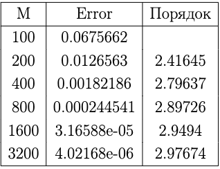
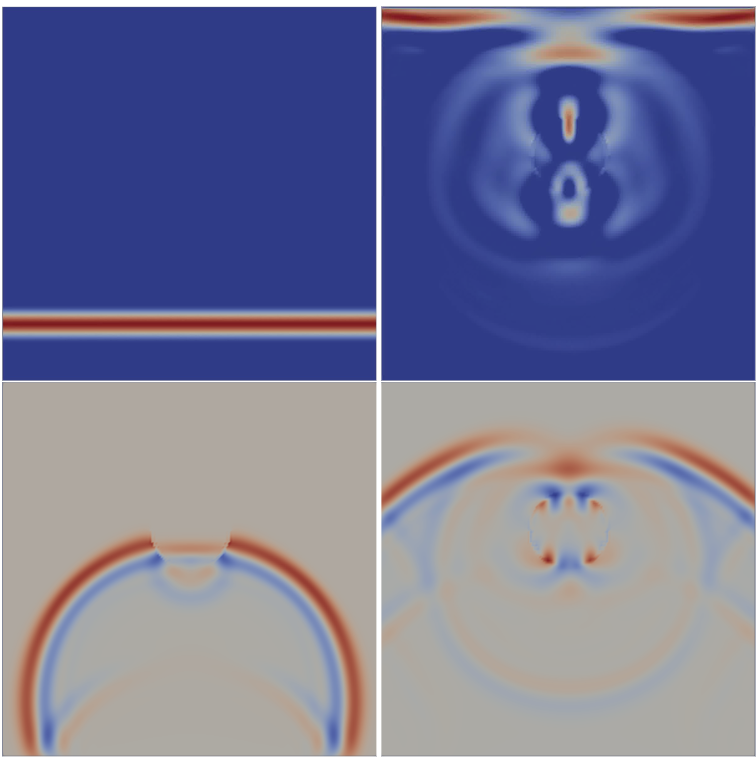

# Immersed Interface Problem

The Immersed Interface Method (IIM) is a technique that facilitates solving the wave propagation equation (in my case, acoustical) in heterogeneous media.

## Intro

The acoustic equation is given by:

$$
\begin{aligned}
    \rho \vec{v}_t + \nabla p &= 0 \\
    p_t + \kappa \nabla \cdot \vec{v} &= 0
\end{aligned}
$$

I examined both one-dimensional and two-dimensional cases. The challenge in the task of wave propagation in multi-media arises at the transition boundary. For points not on the boundary, I adopted the Rusanov scheme, and for boundary points, I developed my own scheme through extrapolation and simple Taylor series expansion (aiming for second-order accuracy).

## Tools

C++ was chosen as the programming language.

## Modeling Results

Knowing the exact solution and modeling results, I calculated the convergence table.

For the two-dimensional case, I observed reflection and refraction of a plane wave on a spherical boundary.

